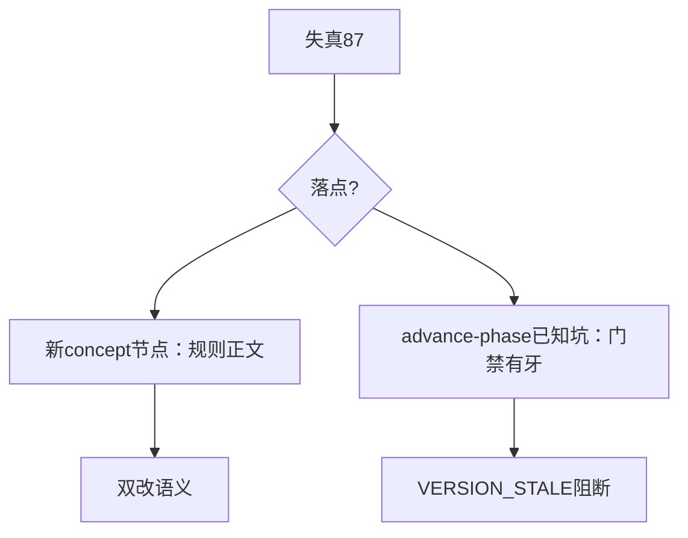
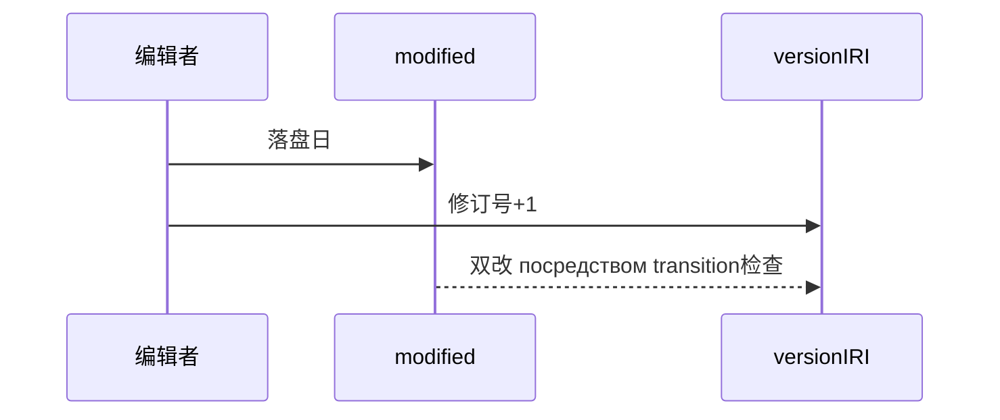
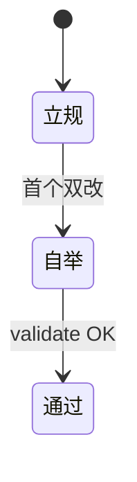

# Research Report — 改时bump规则（T2138）

## 调研目标
终结87节点版本失真：立规则本体+门禁已知坑，并以身作则首个双改自举验证。

## 方法
新建concept/version-bump-rule（双改语义+VERSION_STALE检查法）；advance-phase已知坑追加三条（含本轮两工具坑）；skill-advance-phase双改自举+validate。

## 发现
规则节点新建通过校验；自举双改后validate OK；引用型testable（N=2）待引用数生长（当前仅advance-phase引用+自身）。

### 落点结构（mermaid）

Source: ontology/concept/version-bump-rule.md 规则节

### 双改时序（mermaid）

Source: ontology/domain/skill-advance-phase.md 已知坑节

### 自举状态机（mermaid）

Source: https://lean.org/lexicon-terms/pdca

## 结论与建议
AC全达成；存量87失真分批补，不阻塞新变更；VERSION_STALE门禁实现（digest比对）另起A任务。

## 术语表
- 双改：modified落盘日+versionIRI修订号+1

## 参考资料
- Source: https://lean.org/lexicon-terms/pdca
- Source: https://www.researchgate.net/publication/349440276_PDCA_Cycle_Method_implementation_in_Industries_A_Systematic_Literature_Review
