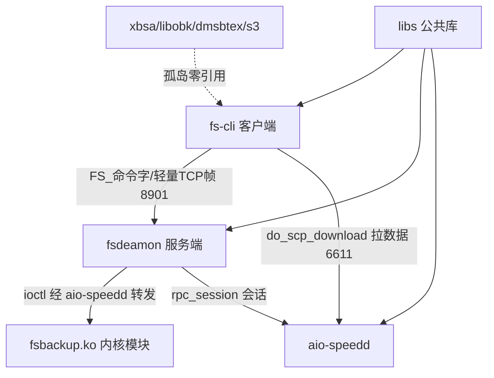
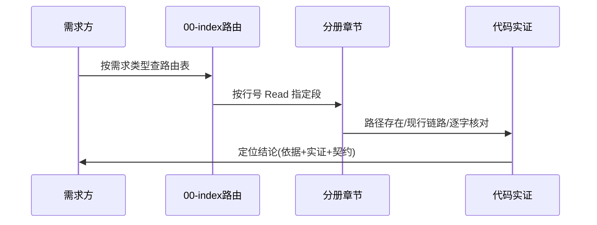
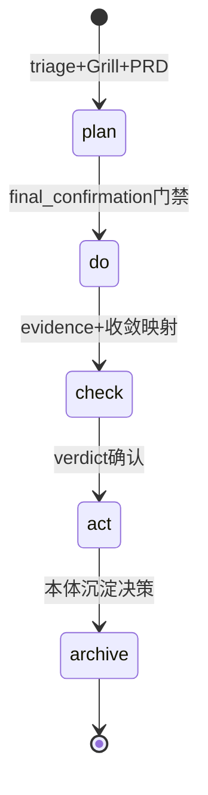
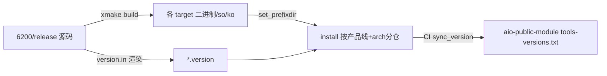

# T2154 research-report：aio-tools 知识地图构建调研

## 调研目标

学习 `rdb-feature-design` 知识地图构建方式（重点 `03-aio-cdm-knowledge-map.md`），为 `aio-tools/6200/release`（6.2.0.0）生成同构导航能力的知识地图，新 skill 名 `rdb-tools-design`，落点 `/home/black/Public/aio/rdb-skills/skills/rdb-tools-design/`。验收 AC-1（00-index 路由全覆盖 + 分册头版本标注）、AC-2（领域→代码表逐条实证）、AC-3（新旧边界与契约核对完整）。

## 方法

1. 精读 `rdb-feature-design/SKILL.md`（五步流程 + 新旧裁决 + 铁律）与 `03`（2385 行，领域→代码表 + 9 阶段链路 + dag_id 契约 + 历史边界）及 `00-index.md`（路由矩阵行号机制）。
2. 精读 `05-aio-public-module-knowledge-map.md`（327 行，能力→代码→使用方 + 复用扩展指南 + 影响范围 + 边界），确定以 05 为主骨架（R3 Grill 确认）。
3. 5 路并行只读勘测本项目（fs-backup / rpc-rdbcomm / libs / s3-xbsa / 构建装配），每条路径要求 file:line 实证，无法确认即标记。
4. 撰写 SKILL.md + 00-index.md + 5 分册，每分册头标注适用分支 6.2.0.0 与实证 commit。
5. 本报告为内部纯代码审查，无外部网络信源——网络门禁走豁免（见结论论证）。

## 发现

- F-1：本项目是 C/Go 混合备份工具集（xmake 构建），无三代模型、无 `dag_id` 契约——03 的「体系×生命周期」骨架不适用，05 的「能力→代码→使用方」骨架适用（R3 确认 05 主 03 辅）。
- F-2：传输契约形态为协议常量（method 字符串 / FS_ 命令字 / MT_ 消息号 / ioctl 字 / 端口），对标 03 的 `dag_id` 三机制 устанавливается逐字核对表（SKILL §3.4）。
- F-3：孤岛模块并存是最大坑——`xbsa/libobk/dmsbtex/s3-tool` 仓内零引用（grep 实证，仅 xmake/version 命中），`huanweicloun-sdk` 半孤岛；对标 03 §6 历史包袱裁决，立 SKILL §4 裁决速查。
- F-4：三份 `dev_ioctl.h`（fs-backup/kernel、fsbackup_kernel_4.x、rpc/）内容一致、`rpc/crc32.c` vs `libs/crc32.c` 并存、`xbsa` 内独立 `thread_pool`——冗余拷贝需认准权威份（01 §7、02 §7）。
- F-5：构建装配自成体系（根 xmake 版本变量 → configvar → version.h/version.log → *.version 随包；install 按产品线+arch 分仓；CI 四阶段）——单列 05 分册，归纳新模块接入三件套。
- F-6：版本目录即分支（41000/41200/6100/6200…），本次基于 `6200/release` = 6.2.0.0，实证 commit `fe9d4364`——分册头统一标注 + §8 分支差异预留（R4 确认）。

### 架构图 C4 L2（mermaid）

Source: `fs-backup/fsdeamon/fs_service.cpp:187-233` 分发分支 + `rpc/rpc-server.cpp:238,326,386` MT_ 分发 + grep 孤岛零引用实证（04 §6）。

### 逻辑图 时序/流程（mermaid）

Source: `rdb-feature-design/SKILL.md:26-68` 五步流程（先路由再验证后输出）。

### 生命周期图 状态机（mermaid）

Source: `$PDCA_HOME/ontology/process/flow-plan.md:32-37` + `flow-do.md:42-49` 阶段门禁定义。

### 数据流/部署（mermaid）

Source: `xmake.lua:12-40` 版本变量与渲染 + `.gitlab-ci.yml:102-161` sync_version + `install/` 实测分仓结构。

## 结论与建议

- C-1：产出 `rdb-tools-design`（SKILL.md 93 行 + 00-index + 5 分册共 762 行）已落 `/home/black/Public/aio/rdb-skills/skills/rdb-tools-design/`，AC-1/2/3 自评满足（待 Check 复核）。验证途径：`ls` 该目录 + `wc -l` + 抽查分册 `file:line` 存在性。
- C-2：网络门禁豁免论证——本任务 primary sources 全部为本地高信任源（本项目源码实证 commit `fe9d4364` + `rdb-feature-design` references + PDCA 流程文件），无任何外部 API/文档事实需要网络佐证；引入网络信源反而降低信源等级。故申请豁免，待 Check 阶段 Grill 确认。验证途径：本报告「参考资料」全为本地路径。
- C-3：7 处「无法确认」已在分册内标记（rdb 默认端口、json.hpp 去重、lz4/crc32 精确调用量、anet_unix、OBS.ini 的 CI 引用、.ko 进包证据、s3 双份主从），不作事实使用。验证途径：各分册 grep「无法确认」。
- C-4：建议后续任务——6100/6110 等分支差异回填（各分册 §8）、「无法确认」7 项二次实证、 Cirrus 跨仓消费方核对（s3/xbsa 的外部调用方）。验证途径：分册 §8 为空即未做。

## 术语表

| 术语 | 定义 |
|---|---|
| 孤岛模块 | 仓内零 import/零 `add_deps` 引用的交付模块（xbsa/libobk/dmsbtex/s3-tool），引用即定位失败 |
| 现行链路 | 被当前调用链实际引用的代码路径（grep 调用方实证），区别于仅存在的文件 |
| 三项实证 | 路径存在 / 现行链路 / 名称逐字一致 |
| 05 主 03 辅 | 方法论决策：05「能力→代码→使用方」为主骨架，吸收 03 任务链写法与实证铁律 |
| 分册头标注 | 每分册头的适用分支 + 目录 + 实证 commit 声明（R4 按分支划分要求） |

## 参考资料

- Source: `/home/black/Public/aio/rdb-skills/skills/rdb-feature-design/SKILL.md`（五步流程/裁决速查/铁律全文 106 行）
- Source: `/home/black/Public/aio/rdb-skills/skills/rdb-feature-design/references/03-aio-cdm-knowledge-map.md`（2385 行，§1.2 领域表/§3 数据库实现地图/§3.5 dag_id/§6 历史边界）
- Source: `/home/black/Public/aio/rdb-skills/skills/rdb-feature-design/references/05-aio-public-module-knowledge-map.md`（327 行，§1.2 能力表/§5 复用扩展/§7 影响范围/§8 加密机制）
- Source: `/home/black/Public/aio/rdb-skills/skills/rdb-feature-design/references/00-index.md`（路由矩阵行号机制）
- Source: 本项目源码 `6200/release`（实证 commit `fe9d4364`，git log -3 可复核）
- Source: 产出 `/home/black/Public/aio/rdb-skills/skills/rdb-tools-design/`（SKILL.md + references/00-index.md + 01–05 分册，`wc -l` 可复核）
