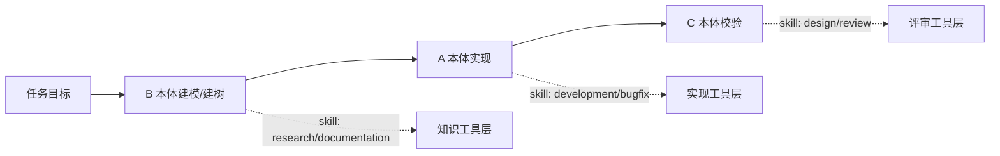
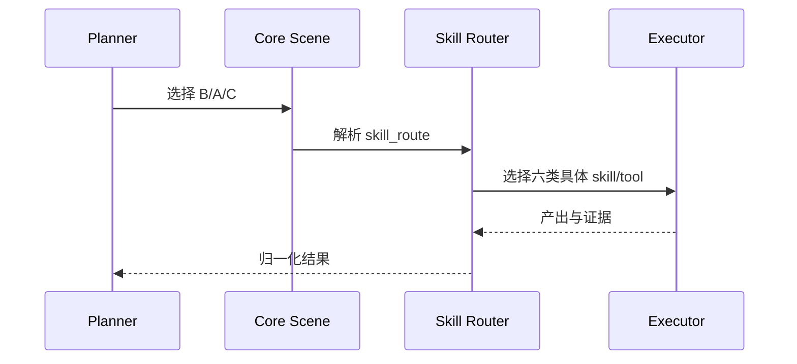
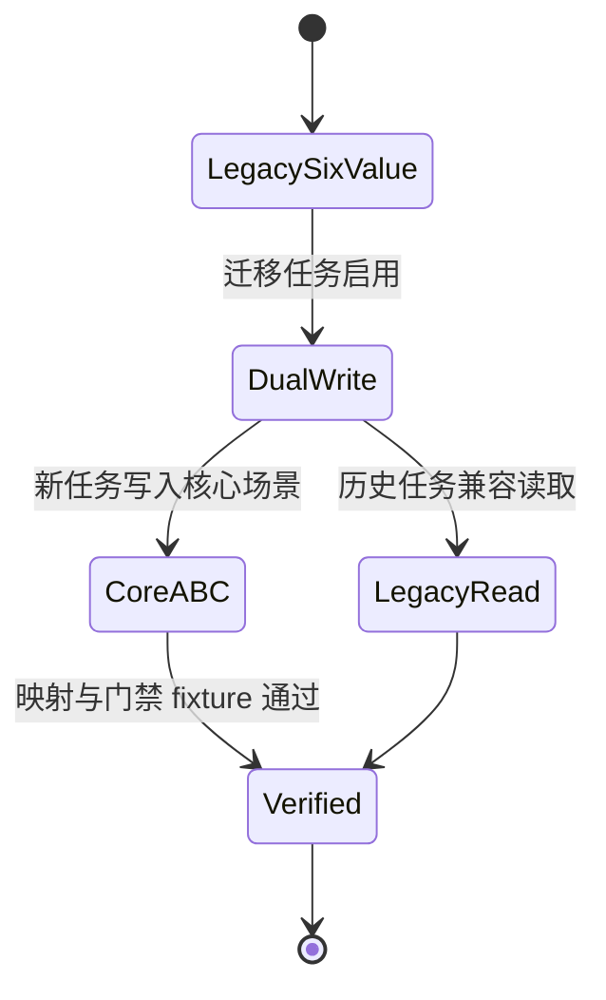

# T2156 PDCA 设计核心 B/A/C 与场景分层复核

## 调研目标

判断 `ontology:concept/pdca` 的“本体树驱动”是否应将 A、B、C 作为唯一核心工作场景，并将 development、bugfix、research、documentation、design、review 下沉为工具/skill 选择；同时判断 A、B、C 的显示名称是否需要优化。

## 方法

采用代码与本体交叉核对：读取 `ontology:concept/pdca`、`ontology:process/flow-do`、任务 schema、路由脚本及 T2153 已归档决议；再用 W3C OWL/SKOS 一手规范校验“层级概念”和“执行属性”应否分离。每个发现均附文件行号、命令或 URL 作为复核路径。

## 发现

### 1. 当前 A/B/C 是核心职责，六值是执行路由

`pdca.md` 已经把 B 定义为建树、A 定义为按树实现、C 定义为逐项校验，并明确映射到知识产出、代码变更、评审校验三条路径（`ontology/concept/pdca.md:36-41`）。这三个定义具有稳定的本体语义：它们描述目标如何从模型进入实现再接受校验。

另一方面，`flow-do.md` 将六个 `scenario_type` 映射到三条路径，每条路径再包含两个具体分支（`ontology/process/flow-do.md:44-47,59-86`）。任务 schema 还把六值硬编码为 enum（`schemas/task.schema.json:84-92`），并由 `task_identity.py`、`check-scenario-mismatch.py`、研究结算检查等脚本直接消费。因此六值目前是实现层的控制字段，不是与 A/B/C 同语义的本体核心。

Source: `ontology/concept/pdca.md:36-41`、`ontology/process/flow-do.md:44-47,59-90`、`schemas/task.schema.json:84-92`。

Source: `ontology/concept/pdca.md:36-41`、`ontology/process/flow-do.md:44-46,71-86`。

### 2. A/B/C 名称需要从动作俗称改成稳定语义名

当前名称“建树、按树实现、逐项校验”能说明操作，但粒度不一致：B 是产物与方向，A 是动作与对象，C 是校验方式。特别是“按树实现”只适合本体树已存在的代码实现，无法覆盖实现任务的公共能力、适配器或非代码执行细节；“逐项校验”又容易被理解为检查清单，而不是本体一致性验证。

建议保留 A/B/C 作为短标签以降低迁移成本，但把规范名称改为：B“本体建模”（Ontology Modeling）、A“本体实现”（Ontology Implementation）、C“本体验证”（Ontology Verification）。保留当前 B→A→C 的实际先后关系；标签不必承担顺序含义。若未来希望标签也表达顺序，可另立兼容迁移把标签改成 A/B/C，但这不是本次核心优化的必要条件。

W3C OWL 将类、属性、个体和数据值作为不同建模构件；W3C SKOS 也把 broader/narrower 层级关系与 related 关联关系区分开。对本仓库的对应启示是：本体模型、实现行为、验证证据应保持职责分离，执行 skill 不应反向定义核心概念。

Source: `ontology/concept/pdca.md:35-41`；[W3C OWL 2 Primer](https://www.w3.org/TR/owl-primer/)；[W3C SKOS Reference](https://www.w3.org/TR/skos-reference/)。

### 3. 推荐“核心 A/B/C + skill 子类型”，不推荐直接删除六值

推荐的目标模型是“双层字段”：核心层记录 `core_scene = B|A|C`，执行层记录 `skill_route` 或等价工具选择。六个现有值可作为过渡期的兼容输入和 skill route 映射，不再作为核心场景概念。映射为：

| 核心场景 | 规范名称 | 当前 skill route |
|---|---|---|
| B | 本体建模 | research / documentation |
| A | 本体实现 | development / bugfix |
| C | 本体验证 | design / review |

这满足用户要求的“只留 A、B、C”在概念层成立，同时保留六种具体工具行为所需的差异。直接把 schema enum 从六值改成 A/B/C 会破坏现有任务记录、父子场景一致性检查、研究结算、bugfix 闸门和执行协议，因此不应作为单票即时改动。

Source: `ontology/process/flow-do.md:44-47,59-90`、`schemas/task.schema.json:61-92`、`scripts/task_identity.py:359-371`、`scripts/check-scenario-mismatch.py:1-9`、`scripts/check-research-ontology-settlement.py:47-53`。

Source: `ontology/process/flow-do.md:44-49,53-57`；`scripts/task_identity.py:359-371`。

### 4. 迁移必须拆成独立 Improvement Task

后续实施至少需要同步五个边界：

1. `schemas/task.schema.json` 增加核心场景字段，并定义旧 `scenario_type` 的兼容期语义。
2. `flow-do.md` 将 A/B/C 作为第一层路由，将六值移入 skill/tool 路由表。
3. `transition-phase.py`、`pdca_core.py` 及相关检查器改为按核心场景执行共性门禁，再按 skill 执行差异门禁。
4. 历史任务继续可读，旧六值转换必须可逆或至少有明确映射和迁移报告。
5. 新增映射校验与 fixture，确保 A/B/C、skill route、产物类型和证据 kind 不发生错配。

T2153 的 backlog 已把旧问题归入后续改进候选，而非本次研究直接实施；本任务不应在研究阶段修改权威流程正文。

Source: `ontology/process/flow-do.md:45-49,71-90`；`ontology/decision/t2153-opt-backlog.md`；`scripts/pdca_core.py:647-685`。

Source: `schemas/task.schema.json:61-92`、`scripts/pdca_core.py:647-685`、`ontology/domain/pdca/skill-advance-phase.md:20-31`。

## 结论与建议

结论：推荐核心概念收敛为 A/B/C，六个具体场景下沉为 skill/tool 选择；同时建议优化显示名称，但保留 A/B/C 标签和当前 B→A→C 顺序以降低迁移成本。

推荐名称为 B“本体建模”、A“本体实现”、C“本体验证”。这里的 A/B/C 是稳定的核心职责标签，不是 schema 中的六值替代品；六值应成为执行路由或兼容字段，待独立 Improvement Task 完成 schema、门禁、历史读取和 fixture 迁移后再考虑移除。

置信度：高。复核途径：`nl -ba ontology/concept/pdca.md | sed -n '35,42p'`、`nl -ba ontology/process/flow-do.md | sed -n '40,90p'`、`nl -ba schemas/task.schema.json | sed -n '61,92p'`，并运行 `python3 scripts/check-research-web-evidence.py --report pdca/tasks/0911-pdca-core-opt-review/research-report.md`。

## 术语表

- **核心场景**：描述本体树生命周期职责的 B/A/C。
- **skill route**：选择具体执行技能或工具的执行层属性。
- **兼容字段**：迁移期间保留以读取历史任务的旧 `scenario_type`。
- **本体验证**：检查实现产物是否遵循本体定义、关系和 testable signal。

## 参考资料

- `ontology/concept/pdca.md:35-41`
- `ontology/process/flow-do.md:40-90`
- `schemas/task.schema.json:61-92`
- `scripts/pdca_core.py:647-685`
- `ontology/decision/t2153-opt-backlog.md`
- https://www.w3.org/TR/owl-primer/
- https://www.w3.org/TR/skos-reference/
