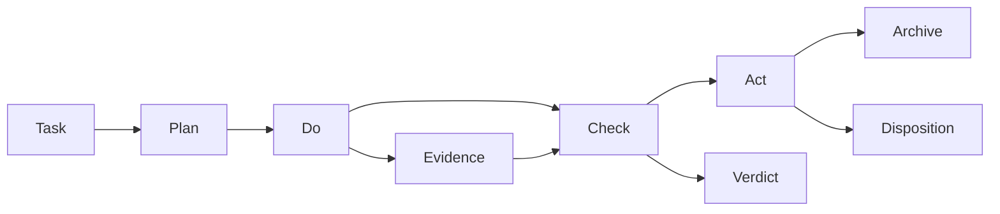

# PDCA 流程本体模型

## 核心节点

- `pdca-task`：周期载体，关联目标、阶段状态、核心场景和产物。
- `pdca-phase`：`plan → do → check → act` 四个方法论阶段；`archive` 是生命周期终态。
- `pdca-transition`：阶段间合法转换及其门禁。
- `pdca-gate`：转换所需的确认、ontology-ready、证据和 verdict 条件。
- `pdca-evidence`：可复核产物及其 acceptance criterion 映射。
- `pdca-verdict`：Check 的 confirmed/rejected/partial 判定。
- `pdca-core-scene-layering`：B 本体建模、A 本体实现、C 本体验证；具体 skill/tool 属 route 层。

## 关系与不变量

`pdca-task` 依次经历 phase transition；Do 产出 evidence；Check 以 evidence 对照 acceptance criteria 生成 verdict；Act 依据 verdict 进行 ontology disposition 和下一轮改进。任一阶段不得跳过其前置 gate；每个 AC 必须映射至少一个 evidence 或显式失败。

Source: `ontology/process/flow-plan.md`、`ontology/process/flow-do.md`、`ontology/process/flow-check.md`、`ontology/process/flow-act.md`。
