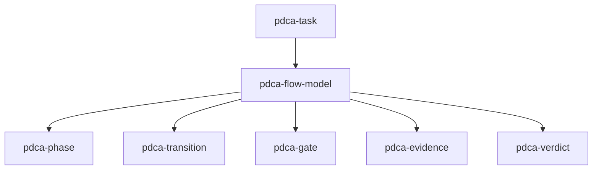
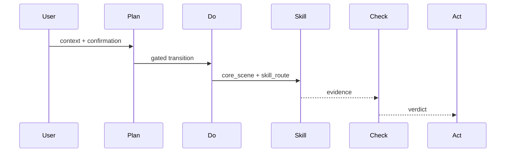
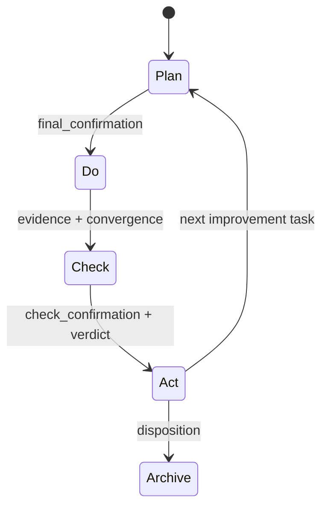

# T2169 PDCA 流程本体剩余问题调研

## 调研目标

检查 `ontology:process/pdca-flow-model` 及其关联 PDCA 流程节点是否仍有结构、关系、门禁或 AI 工作流适配问题。

## 方法

对流程本体、阶段流程、任务 schema、生产脚本和测试引用做交叉检索；用 W3C OWL/SKOS 一手规范核对“组成关系”和“层级关系”的建模边界。

## 发现

### P0：权威模型与全库消费仍未完全统一

`pdca-flow-model`、`pdca.md` 和部分新脚本已使用 `core_scene + skill_route`，但全库仍有旧 `scenario_type` 引用：`task_identity.py` 的内部 API、研究结算文档、triage 检查、测试夹具和多个历史知识节点仍使用旧术语。新 schema 已要求 `core_scene`，因此新旧任务消费可能产生 schema、门禁和测试不一致。

复核：`rg -n 'scenario_type|core_scene|skill_route' scripts ontology tests schemas`。

### P1：skill route 还不是正式本体关系

`skill_route` 当前是自由字符串，流程本体只描述“由核心场景选择 skill/tool”，没有正式的 route 节点、允许值、能力约束、输入输出或证据 kind 关系。AI 执行器可能选择一个语义正确但产物契约错误的 skill。

复核：查看 `ontology/process/pdca-flow-model.md:42-59` 与 `schemas/task.schema.json:84-96`。

### P1：流程树的组成关系尚未覆盖全部核心载体

`pdca-flow-model` 的 `composed_of` 覆盖 phase、transition、gate、evidence、verdict，但 `pdca-task` 仍仅通过 `relates_to` 关联；任务是流程实例的主要载体，应在模型中明确 `pdca-task` 与流程定义的关系，避免流程模型与任务模型之间只有弱关联。

复核：`nl -ba ontology/process/pdca-flow-model.md | sed -n '12,30p'`。

### P1：A/B/C 的标签与执行顺序容易产生认知歧义

模型保留 B→A→C 是为了表达“建模→实现→验证”，但 schema 枚举按 A/B/C 排列，且多个流程标题使用“路径 A/B/C”。这不影响机器语义，却可能使 AI 在只看到标签时误判执行先后。规范名应始终与标签同现，并把“顺序”和“枚举排序”明确区分。

复核：`ontology/concept/pdca.md:32-42`、`ontology/process/flow-do.md:40-90`。

### P2：恢复和效果反馈还停留在文字不变量

流程本体描述了 rejected receipt、verdict 和 Act 处置，但没有把失败恢复策略、重试边界、人工升级、执行效果遥测建成可验证关系。AI 工作流的“可继续执行”和“持续改进”仍主要依赖文字约定。

复核：`ontology/process/pdca-flow-model.md:53-59`、`ontology/process/flow-check.md`、`ontology/process/flow-act.md`。

Source: `ontology/process/pdca-flow-model.md:12-24`。

Source: `ontology/process/flow-plan.md:30-43`、`ontology/process/flow-do.md:40-49`、`ontology/process/flow-check.md:20-29`。

Source: `ontology/domain/pdca/skill-advance-phase.md:20-31`。
Source: https://www.w3.org/TR/owl-primer/。

## 本体问题与实现问题分流

应优化本体：流程组成关系、skill route 的正式语义、失败恢复关系、效果反馈关系。

应留在实现层：旧任务一次性迁移、CLI 参数、脚本读取、测试夹具、receipt 文件格式和具体执行器适配。

## 结论与建议

当前流程本体可以作为基线，但仍有 1 个 P0 一致性问题、3 个 P1 结构/语义问题和 1 个 P2 可观测性问题。下一步优先完成旧引用清理和 skill route 本体化，再补恢复与效果反馈模型。不要继续增加新的流程节点，先让现有模型成为唯一权威。

## 参考资料

- `ontology/process/pdca-flow-model.md`
- `ontology/concept/pdca.md`
- `ontology/process/flow-plan.md`
- `ontology/process/flow-do.md`
- `schemas/task.schema.json`
- `scripts/pdca_core.py`
- https://www.w3.org/TR/owl-primer/
- https://www.w3.org/TR/skos-reference/
